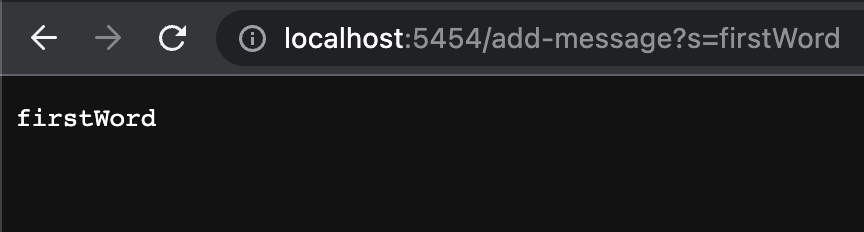
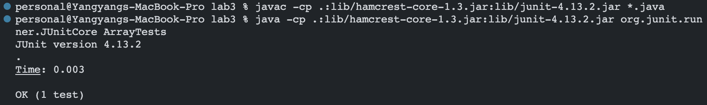
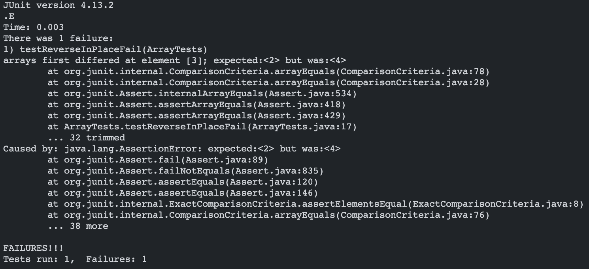

# Lab Report 2 - Servers and Bugs
**Yangyang Liu \
CSE 15L Section B02 \
PID: A17360266**

## Part 1 - StringServer
Here is an implementation for a web server called `StringServer`. \
It keeps track of a single string that get added to by incoming requests.

Note: It makes use of the `Server.java` file found [here](https://github.com/ucsd-cse15l-f22/wavelet/blob/master/Server.java).

```java
// In StringServer.java file

import java.io.IOException;
import java.net.URI;

class StringHandler implements URLHandler {
    
    String str = "";

    public String handleRequest(URI url) {
        if (url.getPath().equals("/")) {
            if (str.equals("")) {
                return "Start adding words";
            }
            return str;
        }
        else if (url.getPath().contains("/add-message")) {
            String[] parameters = url.getQuery().split("=");
            if (parameters[0].equals("s")) {
                str += (parameters[1] + "\n");
                return parameters[1] + " has been added.";
            }
        }
        return "404 Not Found!";
    }
}

class StringServer {
    public static void main(String[] args) throws IOException {
        if(args.length == 0){
            System.out.println("Missing port number! Try any number between 1024 to 49151");
            return;
        }

        int port = Integer.parseInt(args[0]);

        Server.start(port, new StringHandler());
    }
}
```

### Screenshot #1
`/add-message?s=firstWord`



Which methods in your code are called? What are the relevant arguments to those methods, and the values of any relevant fields of the class?

>Note: Some method headers were found from Java documentation

1. `handleRequest(URL url)` method of the `StringHandler` class
    * Argument(s): `url` with value `http://localhost:5454/add-message?s=firstWord`
    * Relevant Fields: `str` with initial value `""`<br><br>

2. `getPath()` method of the `URI` class
    * Called on `https://localhost:5454/add-message?s=firstWord` in `handleRequest` method
    * No relevant arguments
    * Returns the path component of the URI: `/add-message`<br><br>

3. `equals(Object obj)`
    * Called in the `handleRequest` method to compare path component of the URI with the string `"/"`
    * Argument(s): `obj` with value `"\"`
    * Returns boolean value `false`<br><br>

4. `contains(CharSequence s)` method
    * Called in the `handleRequest` method to check if path component of URI contains the string `"/add-message"`
    * Arguments(s): `s` with value `"/add-message"`
    * Returns boolean value `true`<br><br>

5. `getQuery()` method of the `URI` class
    * Called on `https://localhost:5454/add-message?s=firstWord` in `handleRequest` method
    * No relevant arguments
    * Returns the query component of the URI: `"s=firstWord"`<br><br>

6. `split(String regex)` method
    * Called on `"s=firstWord"` in `handleRequest` method
    * Argument(s): `regex` with value `"="`
    * Returns array of strings: `{"s", "firstWord"}`<br><br>


How do the values of any relevant fields of the class change from this specific request? If no values got changed, explain why.

* In the `StringHandler` class:
    * Field: str
    * Initial value: `""`
    * Changed value: `"firstWord\n"`


## Part 2 - Bugs
### `reverseInPlace` in `ArrayExamples.java`
1. Failure-Inducing Input

```java
@Test
public void testReverseInPlace() {
    int[] input = {1, 2, 3, 4, 5};
    ArrayExamples.reverseInPlace(input);
    assertArrayEquals(new int[]{5, 4, 3, 2, 1}, input);
}
```


2. *Nonfailure*-Inducing Input

```java
@Test public void testReverseInPlace() {
    int[] input = {0};
    ArrayExamples.reverseInPlace(input);
    assertArrayEquals(new int[]{0}, input);
}
```


3. Symptoms
    - Passed Test:
    
    &nbsp;&nbsp;&nbsp;&nbsp;&nbsp;&nbsp;&nbsp;&nbsp;
    
    - Failed Test:
    
    &nbsp;&nbsp;&nbsp;&nbsp;&nbsp;&nbsp;&nbsp;&nbsp;


4. Bug

    *BEFORE* code change:
    ```java
    static void reverseInPlace(int[] arr) {
         for(int i = 0; i < arr.length; i += 1) {  // bug in for-loop
           arr[i] = arr[arr.length - i - 1]; // bug in method body
         }
    }
    ```
    
    *AFTER* code change:
    ```java
    static void reverseInPlace(int[] arr) {
         for(int i = 0; i < arr.length/2; i += 1) {  // change to arr.length
           int temp = arr[i];  // added line
           arr[i] = arr[arr.length - i - 1];
           arr[arr.length - i - 1] = temp;  // added line
         }
    }
    ```

## Part 3 - Reflection

    I learned a lot about servers during the Week 2 Lab. I didn't know that a (simple) server was so easy to start.
    It only requires two short Java files for you start your own server. From that lab, I also learned how the "?"
    query could be used in websites. All the things we learned about servers and URLs relates back to the first couple
    weeks where we learned about paths.
