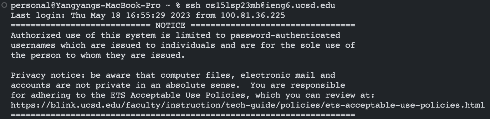
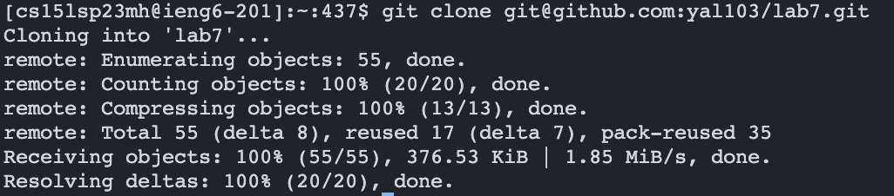
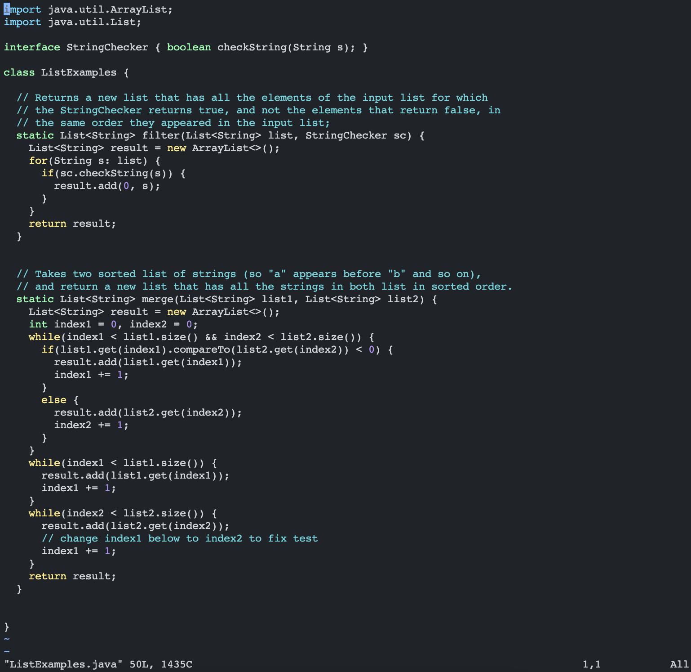
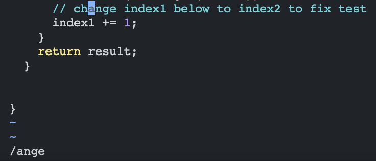
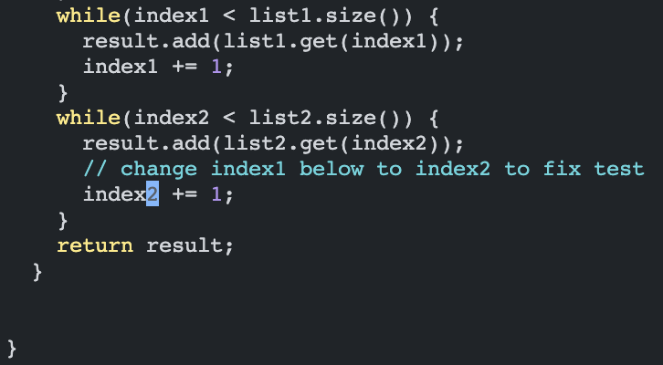
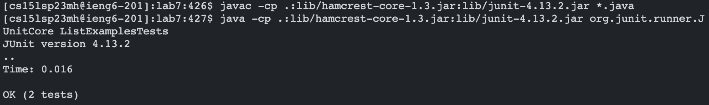
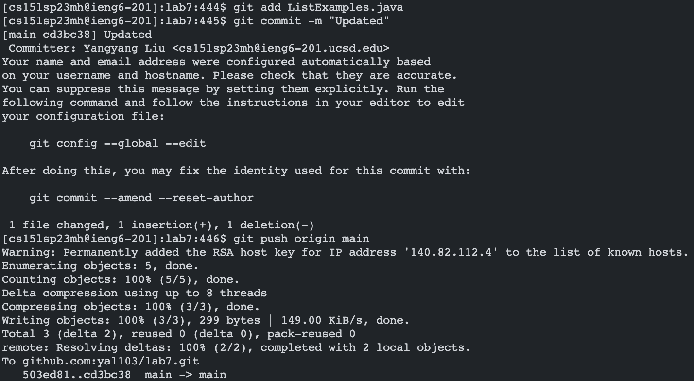
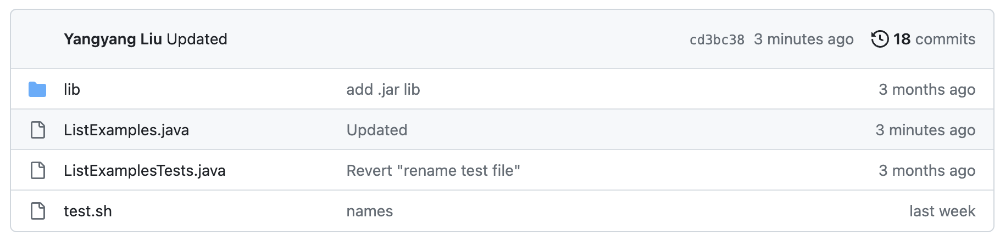

# Lab Report 4 - Doing it All from the Command Line
**Yangyang Liu \
CSE 15L Section B02 \
PID: A17360266**

This lab report reproduces the task from the CSE 15L Spring 2023 [Week 7 Lab](https://ucsd-cse15l-s23.github.io/week/week7/#timing-tasks).

 

## Setting Up (Steps 1 to 3)
1. Delete any existing forks of the repository on GitHub account with contents found [here](https://github.com/ucsd-cse15l-s23/lab7).

2. Fork the repository (from above).

3. Optional: Start a timer if you are timing yourself!

 

## Step 4: Log into ieng6

**Keys pressed:** \
`ssh <space> cs15lsp23mh@ieng6.ucsd.edu <enter>`

* The `ssh` command (followed by an account) is needed to log in to ieng6.

 

## Step 5: Clone your fork of the repository from your Github account

**Keys pressed:** \
`git <space> clone <space> git@github.com:yal103/lab7.git <enter>`

* The `git clone` command (followed by the GitHub repository link) clones the repository into the ieng6 account.
* Note: You can use `<CTRL-C>` and `<CTRL-V>` to copy and paste the repository SSH key: `git@github.com:yal103/lab7.git`.

 

## Step 6: Run the tests, demonstrating they fail

**Keys pressed:** \
`cd <space> lab7 <enter>`

* Changes to the cloned `lab7` directory

 

`javac <space> -cp <space> .:lib/hamcrest-core-1.3.jar:lib/junit-4.13.2.jar <space> *.java <enter>` 
   
`java <space> -cp <space> .:lib/hamcrest-core-1.3.jar:lib/junit-4.13.2.jar org.junit.runner.JUnitCore <space> 
    ListExamplesTests <space>`

* Compiles and runs the JUnit tests for ListExamples.
* The tests should fail.
* Note: You can use `<CTRL-C>` and `<CTRL-V>` to copy and paste the commands.
    - `javac -cp .:lib/hamcrest-core-1.3.jar:lib/junit-4.13.2.jar *.java` followed by `<enter>`
    - `java -cp .:lib/hamcrest-core-1.3.jar:lib/junit-4.13.2.jar org.junit.runner.JUnitCore ListExamplesTests` followed by `<enter>`

 

## Step 7: Edit the code file `ListExamples.java` to fix the failing test

**Keys pressed:** \
`vim <space> ListExamples.java <enter>`

* Views the contents in `ListExamples.java` using the built-in _vim_ text editor.

 

`/ange <enter> <down> r2 :wq <enter>`

* In vim, `/` followed by a string (and `<enter>`) searches the file for the occurences of that string.
* In this case, `ListExamples.java` only has one occurrence of the strin `ange` (in the word `change` above the the needed change).
    - The terminal cursor moves to the first occurrence of `ange` in the file.
* Pressing `<down>` shifts the terminal cursor to the `1` in the `index1` that needs to be changed to `index2`.
* In vim, `r` followed by a character `2` changes the character highlighted by the terminal (`1`) into `2`.
    - `index1` is changed to `index2`.
* `r2` does not change the mode to insert mode, not we do not need to press `<esc>`.
* `:wq` followed by `<enter>` saves and exits out of the vim text editor.

 

 

## Step 8: Run the tests, demonstrating that they now succeed

**Keys pressed:** \
`<up> <up> <up> <enter>` , `<up> <up> <up> <enter>`

* The `javac -cp .:lib/hamcrest-core-1.3.jar:lib/junit-4.13.2.jar *.java` command was 3 up in my command history, so I used the up arrow to access it.
* Similarly, after the previous command was run, the `java -cp .:lib/hamcrest-core-1.3.jar:lib/junit-4.13.2.jar org.junit.runner.JUnitCore ListExamplesTests` command was 3 up in my command history, so I used the up arrow to access it.
* The tests should pass this time.

 

## Step 9: Commit and push the resulting change to your Github account

**Keys pressed:** \
`git <space> add <spa（っ＾▿＾）ce> ListExamples.java <enter>` \
`git <space> commit <space> -m <space> "Updated" <enter>` \
`git <space> push <space> origin <space> main <enter>` 

* The `git add`, `git commit`, and `git push` commands commit and push the changes made to `ListExamples.java` to the GitHub repository.

The file should be updated in the GitHub repository, which the commit message:

 
（っ＾▿＾）
