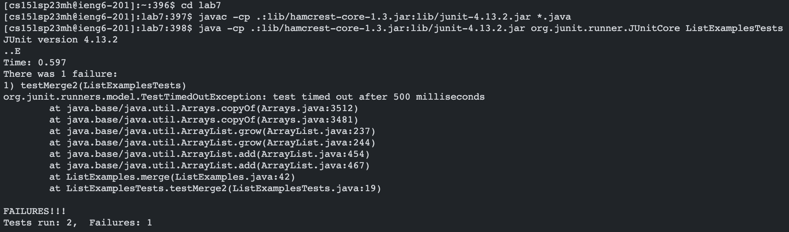

# Lab Report 4 - Doing it All from the Command Line
**Yangyang Liu \
CSE 15L Section B02 \
PID: A17360266**

This lab report reproduces the task from the CSE 15L Spring 2023 [Week 7 Lab](https://ucsd-cse15l-s23.github.io/week/week7/#timing-tasks).

 

## Setting Up (Steps 1 to 3)
1. Delete any existing forks of the repository on GitHub account with contents found [here](https://github.com/ucsd-cse15l-s23/lab7).

2. Fork the repository (from above).

3. Optional: Start a timer if you are timing yourself!

 

## Step 4: Log into ieng6

**Keys pressed:** \
   `ssh <space> cs15lsp23mh@ieng6.ucsd.edu <enter>`

* The `ssh` command (followed by an account) is needed to log in to ieng6.

 

## Step 5: Clone your fork of the repository from your Github account

**Keys pressed:** \
   `git <space> clone <space> https://github.com/ucsd-cse15l-s23/lab71 <enter>`

* The `git clone` command (followed by the GitHub repository link) clones the repository into the ieng6 account.

 

## Step 6: Run the tests, demonstrating they fail

**Keys pressed:** \
   `cd <space> lab7 <enter>`

* Changes to the cloned `lab7` directory

   `javac <space> -cp <space> .:lib/hamcrest-core-1.3.jar:lib/junit-4.13.2.jar <space> *.java <enter>` \
   
   `java <space> -cp <space> .:lib/hamcrest-core-1.3.jar:lib/junit-4.13.2.jar org.junit.runner.JUnitCore <space> 
    ListExamplesTests <space>`

* Compiles and runs the JUnit tests for ListExamples.
* The tests should fail.
