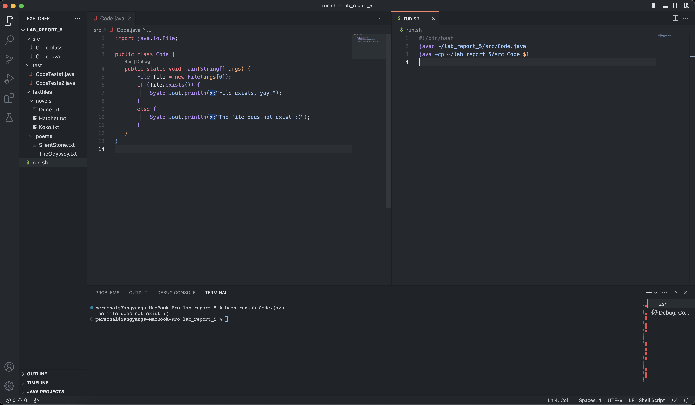

# Lab Report 5 - Putting it All Together
**Yangyang Liu \
CSE 15L Section B02 \
PID: A17360266**

This lab report designs a debugging scenerio on EdStem and has a reflection of the lab during the second half of the quarter.

&nbsp;
&nbsp;

## Part 1 - Debugging Scenario
> **_NOTE:_** I am using parts of the code from Week 9 Lab Scenario 4, found [here](https://ucsd-cse15l-s23.github.io/week/week9/#scenario-4).

### 1. Original Post
**What environment are you using (computer, operating system, web browser, terminal/editor, and so on)?**

I am using a MacBook Pro Max operating on macOS Ventura 13.3.1. My main web browser is Google Chrome. I use VS Code to edit my programs. 

&nbsp;

**Detail the symptoms you're seeing. Be specific; include both what you're seeing and what you expected to see instead. Screenshots are great, copy-pasted terminal output is also great. Avoid saying "it doesn't work".**

I am trying to run my `Code.java` using a bash script, `run.sh`. The Java program is supposed to check if a file exists and print a message acoordingly. However, it's giving an incorrect output. Testing with the `Dune.txt` file, which exists in my `textfiles/novels` directory, the program is printing that the file does not exist, which is not expected.

&nbsp;

**Detail the failure-inducing input and context. That might mean any or all of the command you're running, a test case, command-line arguments, working directory, even the last few commands you ran. Do your best to provide as much context as you can.**

Here is the command I am running in my terminal:
`bash run.sh Dune.txt`

And here is the output I am getting:
`The file does not exist :(`

Here is a screenshot of what I see right now.



&nbsp;

### 2. TA Response

Hi, it seems like you're trying to check if `Dune.txt` exists by passing the name of the file to the program. Can you confirm the absolute path that the program receives? To do this, you can
modify your `Code.java` code to print out the file path the program is trying to access:

```java
import java.io.File;

public class Code {
  public static void main(String[] args) {
    File file = new File(args[0]);
    System.out.println("Trying to access: " + file.getAbsolutePath());
    if (file.exists()) {
      System.out.println("File exists, yay!");
    }
    else {
      System.out.println("The file does not exist :(")
    }
  }
}
```

Run the script again after this modification.

&nbsp;

### 3. Student Response

Here's the new output:
```
Trying to access: /Users/personal/lab_report_5/Code.java
The file does not exist :(
```
So the problem is that the program is not accessing the correct file path.
It isn't looking into the `textfiles/novels` directory where `Dune.txt` is located in.
It is looking in the root directory of the project.

&nbsp;

### 4. Final Information

1. File and Directory Structure:

    ```
    lab_report_5
    |---src
    |   |---Code.class
    |   |---Code.java
    |---test
    |   |---CodeTests1.java
    |   |---CodeTests2.java
    |---textfiles
    |   |---novels
    |   |   |---Dune.txt
    |   |   |---Hatchet.txt
    |   |   |---Koko.txt
    |   |---poems
    |   |   |---SilentStone.txt
    |   |   |---TheOdyssey.txt
    |---run.sh
    ```
    
    &nbsp;

2. Contents BEFORE Fixing Bug:

  - Code.java:
    ```java
    import java.io.File;

    public class Code {
       public static void main(String[] args) {
           File file = new File(args[0]);
           if (file.exists()) {
               System.out.println("File exists, yay!");
           }
           else {
               System.out.println("The file does not exist :(");
           }
       }
    }

    ```
  - run.sh
    ```
    javac ~/lab_report_5/src/Code.java
    java -cp ~/lab_report_5/src Code $1
    ```
    
    &nbsp;

3. Bug-Triggering Command Line:

    `bash run.sh Dune.txt`
    
    &nbsp;
    
4. Fixing the Bug

    The bug in the program is that the bash script is passing in only the filename to the Java program.     Java uses relative pathing, so it looks for the file in the root directory, not `textfiles/novels`.
  
    To fix this bug, we can modify the `run.sh` bash script to pass in the correct relative path to the     Java program:
    
    ```
    javac ~/lab_report_5/src/Code.java
    java -cp ~/lab_report_5/src Code */*/$1
    ```
    
    Running `bash run.sh Dune.txt` should print:
    `File exists, yay!`
    
    > **_NOTE:_** This only works for the .txt files in this structure.
    
    &nbsp;
 
 ## Part 2 - Reflection
 
 Something I found really cool during my lab experience in the second half of this quarter was `vimtutor`, which we used during the Week 7 lab. It was pretty cool that we can learn how to edit files directly from the terminal using `vim` FROM the terminal. I enjoyed learning the various useful vim shortcuts through the an interactive lesson in the terminal.
