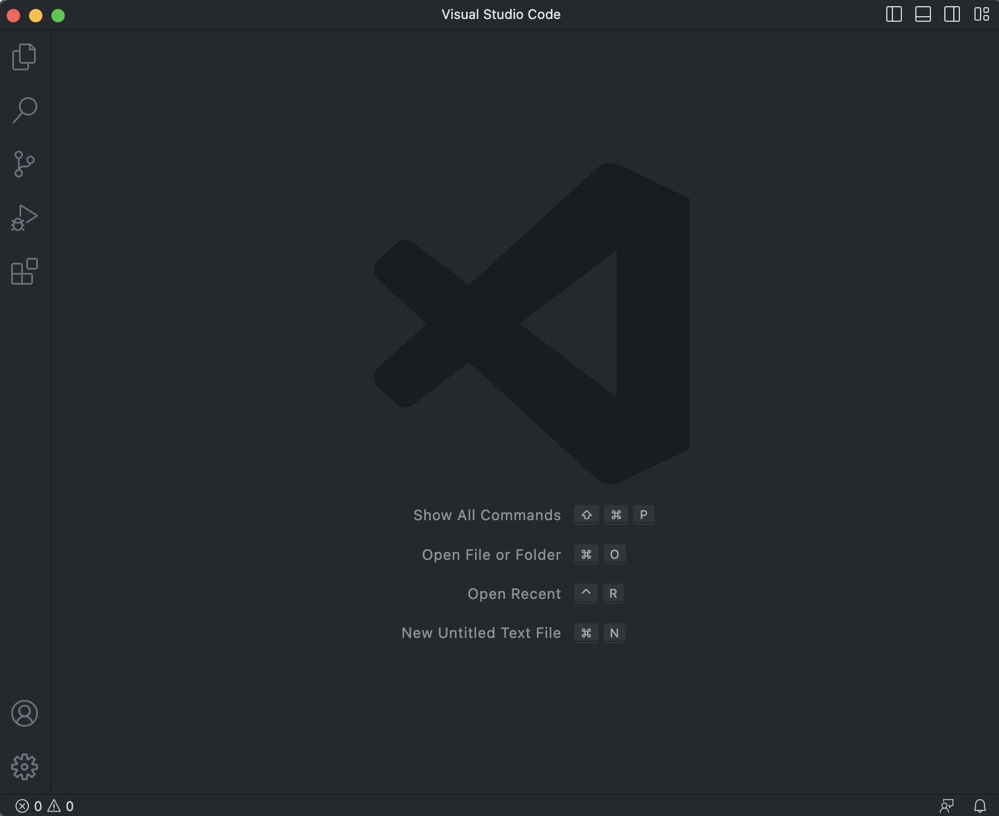
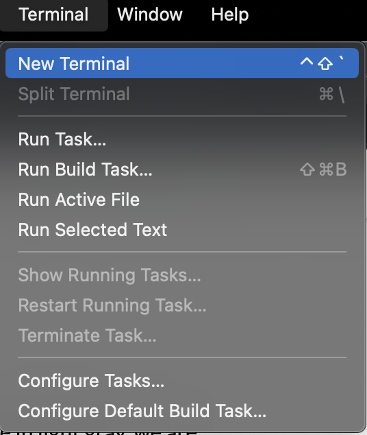
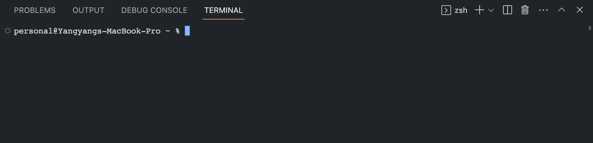
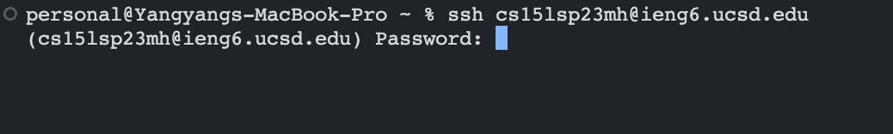
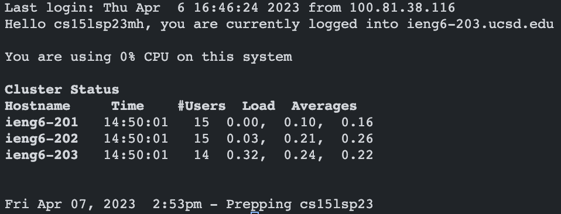
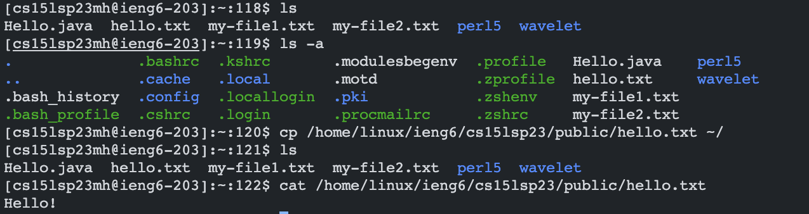

# Lab Report 1 - Remote Access and FileSystem

**Yangyang Liu \
CSE 15L Section B02 \
PID: A17360266**

This is a quick tutorial on how to log into a course-specific account on `ieng6` and connect to a remote computer over the internet.

---

### SETUP
1. Find your CSE 15L course-specific account [here](<https://sdacs.ucsd.edu/~icc/index.php>). Use this [guide](https://drive.google.com/file/d/17IDZn8Qq7Q0RkYMxdiIR0o6HJ3B5YqSW/view?usp=share_link) to reset your password.
    > Note that it may take several minutes for the password reset to take effect.
2. Open Visual Studio Code. If you don't already have it downloaded, download it [here](https://code.visualstudio.com/download).

   The window should look something like this.
     
    

3. *Skip to Step 4 if you are on MacOS.* If you are using a **Windows** device, make sure that you have 'git' downloaded.

    [Download Git for Windows](https://gitforwindows.org/)

    After installing git, follow the these [steps](https://stackoverflow.com/a/50527994) to set your default terminal to use 'git bash' in Visual Studio Code.

4. Open a terminal in Visual Studio Code.
    - On **MacOS**, press control + ` , or use the menu option Terminal→New Terminal.
    - On **Windows**, press Ctrl + ` .
 
&nbsp;&nbsp;&nbsp;&nbsp;&nbsp;&nbsp;&nbsp; 

---
        
### CONNECTING REMOTELY
1. In the terminal, type the command `ssh` followed by your CSE 15L course-specific account and press enter. \
For example: \
    ```$ ssh cs15lsp23mh@ieng6.ucsd.edu```
2. If this is your first time you are connecting to the server on your device, you will likely receive a message like this:

    ```
    The authenticity of host 'ieng6-202.ucsd.edu (128.54.70.227)' can't be established. 
    RSA key fingerprint is SHA256:ksruYwhnYH+sySHnHAtLUHngrPEyZTDl/1x99wUQcec.
    Are you sure you want to continue connecting (yes/no/[fingerprint])?
    ```
    Type `yes` and press enter.

3. You will be asked to enter the password to your CSE 15L course-specific account.
    > Note: What you type will not visibly appear in the terminal but will be inputed.
    
    
    
4. Once you are successfully logged in, your terminal should display something like this.

     
    
    Your terminal is now connected to a computer in the CSE basement! Any commands you run on your terminal will run on that computer.

---

### RUNNING COMMANDS
Here is a list of commands you can try running on both **your computer** and the **remote computer**:
```
1. cd

2. cd ~

3. ls

4. ls -lat

5. ls -a

6. ls <directory> where "<directory>" is
    "/home/linux/ieng6/<course>/<username>" where "<course>" is the name of your
    CSE 15L course (eg. cse15lsp23) and "<username>" is your course-specific username (eg. cs15lsp23mh)
    
7. cp /home/linux/ieng6/cs15lsp23/public/hello.txt ~/

8. cat /home/linux/ieng6/cs15lsp23/public/hello.txt
```
**NOTE: Code Block does not appear in PDF version.**

Here is an example of a combination of the above commands:



To **log out** of the remote server, use:

* Ctrl + D
* Run the command `exit`
